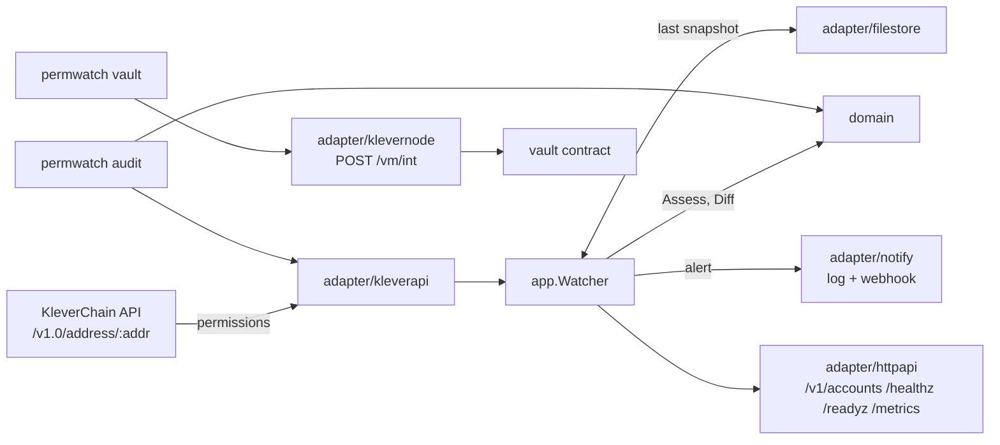

# permwatch

**Who can sign for your KleverChain account, and did that just change?**

## Problem

A KleverChain account is not controlled only by its own key. The owner can add
*permissions*: other keys that may send transactions for the account, alone or
together, for a chosen set of operations. Treasuries, validators and token issuers
use this for multi-signature and for delegating day-to-day work.

That flexibility is also the attack. One `UpdateAccountPermission` transaction —
sent by a phished owner, a compromised delegate or a rushed operator — can let a
new key transfer the account's funds, or rewrite the permissions and take the
account. Nothing moves when it happens, so a balance alert stays silent until the
funds are gone. Reading the permissions by hand means decoding a hex bitmask per
permission, and nobody does that every day.

permwatch reads the permissions, says in plain words what each key can do, flags
the dangerous combinations, and alerts the moment they change.

## What it does

- **`permwatch audit <address>...`** — one-shot report: every permission, its
  signers, the operations its bitmask allows, and the risk findings. Exits `2`
  when there is a critical or high finding, so it fits a CI job or a cron check.
- **`permwatch vault <contract>...`** — reads a spending-limit vault contract
  ([klever-contracts/vault](https://github.com/Amadeus-22/klever-contracts)) and
  reports how much of the current period's allowance is used. Exits `2` once the
  warning line (`-warn`, default 80%) is reached.
- **`permwatch watch`** — long-running service: polls a list of accounts and
  vaults. For accounts it keeps the last permissions seen on disk and alerts when
  they change, listing what changed and what the new state allows. For vaults it
  alerts when spending crosses the warning line and again when the limit is
  reached. Alerts go to the log and, if configured, to a webhook and to Telegram.

### Rules

| Rule | Severity | Fires when |
|---|---|---|
| `foreign_owner` | critical | Keys other than the account's own can reach the threshold of the **owner** permission, so they control the account without the account key. |
| `can_change_permissions` | critical | A **user** permission held by another key allows `UpdateAccountPermission`: its signers can rewrite the permissions and promote themselves. |
| `single_signer_moves_funds` | high | A user permission lets one other key, alone, send an operation that moves value (`Transfer`, `Withdraw`, `Claim`, `AssetTrigger`, `Buy`, `Sell`, `SmartContract`). |
| `unknown_operations` | low | The bitmask grants contract types this version has no name for. |

### Changes reported

`permission_added`, `permission_removed`, `signer_added`, `signer_removed`,
`weight_changed`, `threshold_lowered`, `threshold_raised`, `operations_widened`,
`operations_narrowed`, `type_changed`.

The first time an account is seen its state is stored as the baseline and no
alert is sent. The owner permission the chain writes down when the first
permission is set (the account's own key, alone) is not reported as a change.

## Architecture



Layers follow `domain` ← `app` ← `adapter` ← `cmd`. The package map and failure
modes are in [docs/ARCHITECTURE.md](docs/ARCHITECTURE.md).

## Quick start

```bash
make build

# audit an account (testnet account set up for this project)
./bin/permwatch audit -api https://api.testnet.klever.org \
  klv1x4lhywvzqt4dhz92tps2a2jfrsn2qljz7c89njver2e6nmamkjhq62e787
```

```
klv1x4lhywvzqt4dhz92tps2a2jfrsn2qljz7c89njver2e6nmamkjhq62e787
  permission 0 (user) "treasury"  threshold 1  allows [Transfer]
    signer klv1uah7ye2sq6vdnlksf6v3q5mtp2yf87352ghy8hve2khxjjcu3vqqaycqgs  weight 1
  permission 1 (owner) ""  threshold 1  allows any transaction
    signer klv1x4lhywvzqt4dhz92tps2a2jfrsn2qljz7c89njver2e6nmamkjhq62e787  weight 1
  [high] single_signer_moves_funds: permission "treasury" lets klv1uah7ye2sq6vdnlksf6v3q5mtp2yf87352ghy8hve2khxjjcu3vqqaycqgs move value alone, with no second signature (Transfer)
```

Watch accounts and vaults:

```bash
cp .env.example .env      # set PERMWATCH_ADDRESSES, or PERMWATCH_CONFIG_FILE
make run                  # or: docker compose -f deploy/docker-compose.yml up --build
curl localhost:8080/v1/accounts
curl localhost:8080/v1/vaults
```

With a watch list file ([permwatch.example.yaml](permwatch.example.yaml)) each
target gets a label and an owner, which appear in alerts, logs and the API:

```yaml
accounts:
  - address: klv1x4lhywvzqt4dhz92tps2a2jfrsn2qljz7c89njver2e6nmamkjhq62e787
    label: demo treasury
    owner: finance team
vaults:
  - contract: klv1qqqqqqqqqqqqqpgqprrwnlul05prr753xm278kq6jexa0a523vqq5gvgsc
    label: ops vault
    owner: ops team
    warn_percent: 80
```

`audit` flags: `-api URL` (default mainnet), `-json`, `-timeout 10s`.

Check a limit vault:

```bash
./bin/permwatch vault -node https://node.testnet.klever.org \
  klv1qqqqqqqqqqqqqpgqprrwnlul05prr753xm278kq6jexa0a523vqq5gvgsc
```

```
klv1qqqqqqqqqqqqqpgqprrwnlul05prr753xm278kq6jexa0a523vqq5gvgsc
  limit 10000000  spent 10000000  remaining 0  used 100%
  [high] vault_near_limit: vault klv1qqqq…5gvgsc has used 100% of its limit this period (10000000 of 10000000, 0 left)
```

Amounts are in the token's smallest unit (KLV has 6 decimals: `10000000` is 10 KLV)
and are never converted to floating point. The output above is from the first
hour after the vault was deployed; the allowance resets every period.
`vault` flags: `-node URL` (default mainnet), `-warn 80`, `-json`, `-timeout 10s`.

## Deployment

| How | Where | Checked by |
|---|---|---|
| Docker Compose | `deploy/docker-compose.yml` | — |
| systemd, with Ansible | `deploy/ansible/`: a role that creates a service account, installs the binary, writes the watch list and an environment file readable only by the service group, and installs a hardened unit (`ProtectSystem=strict`, no capabilities). | `deploy/ansible/test/run.sh` runs it twice against a systemd container and fails unless the second run changes nothing and `/healthz` answers. |
| Kubernetes, with Helm | `deploy/helm/permwatch/`: Deployment (one replica, `Recreate`, non-root, read-only root filesystem), ConfigMap for the watch list, Secret for alert channels, PVC for the snapshots, optional ServiceMonitor. | `deploy/helm/test.sh` installs it in a kind cluster and checks readiness and the API. |

```bash
make build
ansible-playbook -i inventory.ini deploy/ansible/playbook.yml       # see deploy/ansible/*.example.*
helm install permwatch deploy/helm/permwatch -f my-values.yaml      # see ci-values.yaml
```

## Configuration

`watch` is configured by environment variables, validated at startup; every
problem is reported at once.

| Variable | Default | Meaning |
|---|---|---|
| `PERMWATCH_ADDRESSES` | — | Comma-separated `klv1…` addresses to watch. Set this or `PERMWATCH_CONFIG_FILE`, not both. |
| `PERMWATCH_CONFIG_FILE` | — | YAML watch list with accounts and vaults, each with an optional `label` and `owner`; vaults take `warn_percent` (1–100, default 80). Unknown keys are errors. |
| `PERMWATCH_API_URL` | `https://api.mainnet.klever.org` | KleverChain API, used for accounts. Testnet: `https://api.testnet.klever.org`. |
| `PERMWATCH_NODE_URL` | `https://node.mainnet.klever.org` | KleverChain node, used for vaults. Testnet: `https://node.testnet.klever.org`. |
| `PERMWATCH_API_TIMEOUT` | `10s` | Timeout of each API, node, webhook and Telegram request. |
| `PERMWATCH_POLL_INTERVAL` | `1m` | Time between checks of the watch list. |
| `PERMWATCH_HTTP_ADDR` | `:8080` | Listen address of the HTTP API. |
| `PERMWATCH_STATE_DIR` | `./data` | Directory of the per-account snapshots. |
| `PERMWATCH_WEBHOOK_URL` | — | If set, alerts are POSTed here as JSON. |
| `PERMWATCH_TELEGRAM_BOT_TOKEN`, `PERMWATCH_TELEGRAM_CHAT_ID` | — | If both are set, alerts are sent as messages by that bot to that chat. The token is never written to the log. |
| `PERMWATCH_LOG_LEVEL` | `info` | `debug`, `info`, `warn` or `error`. |
| `PERMWATCH_SHUTDOWN_TIMEOUT` | `10s` | Grace period for in-flight HTTP requests on shutdown. |

## API

| Endpoint | Returns |
|---|---|
| `GET /v1/accounts` | Latest report of each watched account: permissions, findings, `checked_at`. |
| `GET /v1/vaults` | Latest report of each watched vault: limit, spent and remaining (decimal strings), `used_percent`, warnings. |
| `GET /healthz` | `200` while the process is alive. |
| `GET /readyz` | `200` once the first pass over the watch list has finished; `503` before. |
| `GET /metrics` | Prometheus metrics. |

Errors are `{"error":{"code":"snake_case","message":"..."}}`.

Webhook body for a permissions change (`label` and `owner` appear when set):

```json
{
  "kind": "permissions_changed",
  "address": "klv1x4lh…",
  "label": "demo treasury",
  "owner": "finance team",
  "changes": [{"kind": "permission_added", "permission_id": 0,
               "message": "user permission \"treasury\" added with 1 signer(s), threshold 1"}],
  "findings": [{"rule": "single_signer_moves_funds", "severity": "high", "permission_id": 0,
                "signers": ["klv1uah7…"], "message": "…"}],
  "at": "2026-10-04T00:29:48Z"
}
```

For a vault, `kind` is `vault_near_limit` and `vault` holds the report served by
`/v1/vaults`. A vault alerts when its level rises — once at the warning line,
once at the limit — and resets silently when a new period starts.

A webhook or Telegram answer outside `2xx` leaves the stored state untouched, so
the same alert is sent again on the next cycle. The Telegram message is plain text:

```
Permissions changed: demo treasury (klv1x4lh…)
- user permission "treasury" added with 1 signer(s), threshold 1
What the account allows now:
[HIGH] permission "treasury" lets klv1uah7… move value alone, with no second signature (Transfer)
Owner: finance team
```

## Metrics

| Metric | Type | Labels | Meaning |
|---|---|---|---|
| `permwatch_polls_total` | counter | `result` (`ok`, `error`) | Account checks. |
| `permwatch_changes_total` | counter | `kind` | Permission changes detected. |
| `permwatch_findings` | gauge | `address`, `severity` | Open findings as of the last check. |
| `permwatch_last_success_timestamp_seconds` | gauge | `address` | Unix time of the last successful check. |
| `permwatch_vault_checks_total` | counter | `result` (`ok`, `error`) | Vault checks. |
| `permwatch_vault_used_percent` | gauge | `contract` | Share of the vault's limit withdrawn in the current period. |

Alert on `permwatch_findings{severity="critical"} > 0` and on
`time() - permwatch_last_success_timestamp_seconds > 300`.

## Design decisions

- [0001 — Poll the account endpoint instead of indexing transactions](docs/adr/0001-poll-account-state.md)
- [0002 — Snapshots in JSON files, not a database](docs/adr/0002-file-snapshots.md)
- [0003 — Decode the operations bitmask locally, without the chain's protobuf types](docs/adr/0003-local-bitmask-decoding.md)
- [0004 — Alert on vault level changes, with the level kept in memory](docs/adr/0004-vault-alert-levels-in-memory.md)

## Verified against testnet

On 2026-10-03, with `watch` polling every 5 s and a local webhook receiver, an
`UpdateAccountPermission` transaction
(`4ba7158458fdd89746eb3c3e4d0055a6dae7f13b2dc0f32692a1d48d8e73584e`) added the
`treasury` permission above. The webhook received one alert about 10 s later and
no repeat on the following cycles. `make test-integration` reads that account
from the live API.

The same day the vault contract was deployed on testnet with a limit of 10 KLV per
hour. `permwatch vault` reported 40% after a 4 KLV withdrawal and 100% (exit `2`)
after 6 KLV more; the contract itself rejected a withdrawal over the limit. With
`watch` started from a YAML file while the vault was at 100%, the webhook received
one `vault_near_limit` alert carrying the label and owner, and none in the next
seven checks. The step from the warning line to the limit is covered by unit
tests, not by a testnet run. Telegram delivery is tested against a local HTTP
server, not against the real Bot API.

## Roadmap

1. Persist the vault alert level, so a restart does not repeat an alert.
2. A rule for owner permissions whose signers have never sent a transaction.
3. KDA token vaults, when [klever-contracts](https://github.com/Amadeus-22/klever-contracts) supports them.
