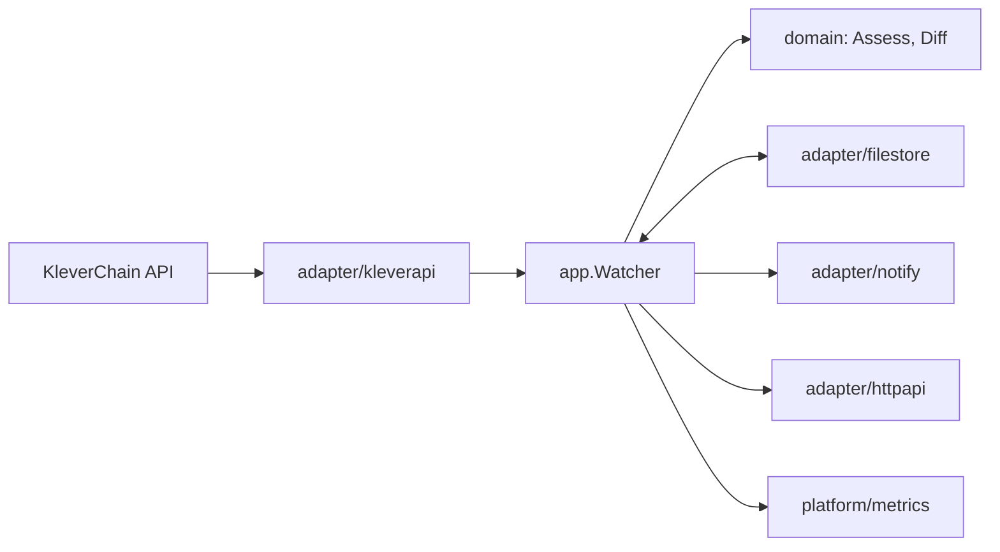

# Architecture

## Problem

KleverChain accounts can grant other keys the right to sign for them
(permissions). A permission change moves no funds, so balance monitoring does not
see it; it only sets up who can move them later. permwatch makes the permissions
readable, judges them, and alerts when they change. See the README for the full
statement.

## Scope

In: reading permissions from the public API, risk rules, change detection,
alerting by log and webhook, a read-only HTTP API, Prometheus metrics.

Out: signing or sending transactions, holding keys, indexing transaction history,
watching balances.

## Diagram

## Package map

| Package | Responsibility |
|---|---|
| `cmd/permwatch` | Wiring only: flags, config, dependencies, start, shutdown. Subcommands `audit` and `watch`. |
| `internal/domain` | `Address`, `Permission`, `Operations` bitmask, `Assess` (risk rules), `Diff` (changes). No I/O. |
| `internal/app` | `Audit` use case, `Watcher` loop, and the ports `AccountSource`, `SnapshotStore`, `Notifier`, `Observer`. |
| `internal/adapter/kleverapi` | `AccountSource` over `GET /v1.0/address/{addr}`: timeout, bounded jittered retries. |
| `internal/adapter/filestore` | `SnapshotStore`: one JSON file per account, replaced atomically. |
| `internal/adapter/notify` | `Notifier`s: structured log, webhook, and `Multi` to fan out. |
| `internal/adapter/httpapi` | `/v1/accounts`, `/healthz`, `/readyz`, `/metrics`. |
| `internal/platform/config` | Environment variables → validated `Config`. |
| `internal/platform/metrics` | Prometheus collectors; implements `app.Observer`. |
| `internal/platform/backoff` | Jittered exponential delay. |
| `internal/platform/logging` | JSON `slog` logger. |

## Failure modes

| Failure | Behaviour |
|---|---|
| API timeout, connection error, `429` or `5xx` | Retried up to 3 times with jittered backoff (0.5 s → 5 s), then the check fails. |
| API `404` (account never used) or `400` | Not retried. The check fails and is counted. |
| Check of one account fails | Logged, counted in `permwatch_polls_total{result="error"}`; the other accounts are still checked. No snapshot is written. |
| Webhook down or non-2xx | The snapshot is not advanced, so the next cycle detects the same change and sends it again. |
| Process killed while saving | Snapshots are written to a temp file and renamed; the old or the new file survives, never a partial one. |
| Corrupt snapshot file | The check fails with the file path in the error; permwatch does not overwrite it silently. |
| Stale data | `permwatch_last_success_timestamp_seconds` stops advancing; alert on its age. |
| `SIGINT` / `SIGTERM` | The watcher stops after the current request, the HTTP server drains within `PERMWATCH_SHUTDOWN_TIMEOUT`, and `watch` returns once both goroutines have ended. |

## Known limits

- Address validation checks prefix, length and alphabet, not the bech32 checksum.
  A wrong checksum is rejected by the API (`400`).
- A change made and reverted between two polls is not seen (see ADR 0001).
- The API is trusted: permwatch does not verify the response against a node.

## Metrics

Listed in the README; defined only in `internal/platform/metrics`.

## ADRs

- [0001 — Poll the account endpoint instead of indexing transactions](adr/0001-poll-account-state.md)
- [0002 — Snapshots in JSON files, not a database](adr/0002-file-snapshots.md)
- [0003 — Decode the operations bitmask locally](adr/0003-local-bitmask-decoding.md)
